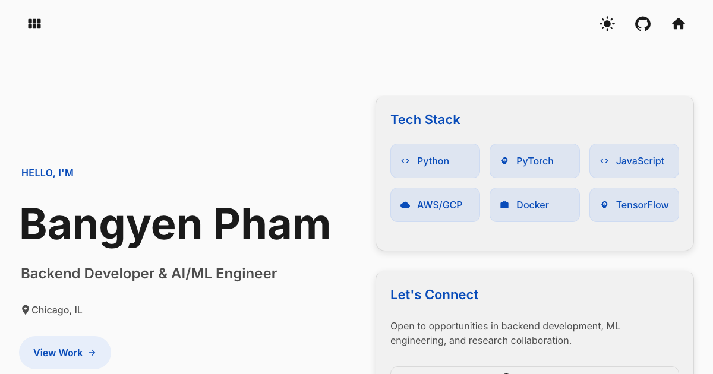

# Bangyen's Portfolio

[](https://github.com/bangyen/bangyen.github.io/actions/workflows/ci-cd.yml)
[](https://react.dev/)
[](https://www.typescriptlang.org/)
[](https://vite.dev/)

An interactive engineering portfolio combining research visualizations with
algorithmic puzzle games. The site is a typed React application deployed as an
installable PWA on GitHub Pages.

**[Visit the live site](https://bangyen.github.io)** ·
**[Architecture](ARCHITECTURE.md)** · **[Contributing](CONTRIBUTING.md)**



## What is inside

- **Lights Out** — an interactive grid puzzle with Gaussian elimination over
  GF(2).
- **Slant** — procedurally generated logic puzzles using graph traversal,
  disjoint-set union, cycle detection, and background workers.
- **ZSharp** — interactive views of sharpness-aware neural-network optimization
  experiments.
- **Oligopoly** — an agent-based Cournot competition visualization with
  adjustable market parameters.

Game algorithms and state are written in TypeScript and kept separate from
React rendering. Expensive Slant generation and solving run in Web Workers.

## Stack

- React 19, React Router 7, Material UI 7, and Emotion
- TypeScript 5 with strict and unchecked-index checks
- Vite 7 and Bun 1.3.9
- Recharts for research visualizations
- Vitest, Testing Library, vitest-axe, Playwright, and Lighthouse CI
- `vite-plugin-pwa`/Workbox for generated, versioned offline support

## Run locally

Requirements: [Bun 1.3.9](https://bun.sh/) and, only when regenerating research
data, Python 3 and Git.

```bash
git clone https://github.com/bangyen/bangyen.github.io.git
cd bangyen.github.io
bun install --frozen-lockfile
bun run dev
```

Open <http://localhost:3000>.

## Quality commands

| Command                 | Purpose                                                  |
| ----------------------- | -------------------------------------------------------- |
| `bun run ci`            | Lint, type-check, cover, build, and check bundle budgets |
| `bun run test`          | Run unit and component tests                             |
| `bun run test:coverage` | Test and enforce the current coverage baseline           |
| `bun run test:e2e`      | Test desktop and mobile production builds in Chromium    |
| `bun run lighthouse`    | Check performance, accessibility, practices, and SEO     |
| `bun run build:analyze` | Build and open the bundle visualization                  |
| `bun run data:update`   | Regenerate and compress the research datasets            |

Install the Playwright browser once before the first local end-to-end run:

```bash
bunx playwright install chromium
```

Coverage thresholds begin at the measured baseline and should rise over time.
CI rejects any JavaScript chunk over 400 KiB or a total JavaScript build over
1 MiB.

## Structure

```text
src/
├── components/          Shared layout and UI primitives
├── config/              Routes, content, and design tokens
├── features/
│   ├── games/           Shared game framework, Lights Out, and Slant
│   ├── home/            Portfolio landing page
│   └── research/        Research charts, controls, and data loaders
├── hooks/               Cross-feature React hooks
├── styles/              Global MUI styles
└── utils/               Shared algorithms and test utilities
e2e/                     Production-build browser tests
scripts/                 Data generation and build-budget checks
public/                  Icons, fonts, redirect fallback, and compressed data
```

Clean browser URLs are supported on GitHub Pages by a small `404.html` recovery
page. Route titles, descriptions, canonical URLs, and social metadata update on
navigation. The service worker and manifest are generated during builds; do not
edit files under `build/`.

## Deployment

Pull requests run linting, type checks, coverage, a production build, browser
tests, Lighthouse, and bundle budgets. A successful push to `main` is deployed
through the official GitHub Pages artifact workflow.

Research datasets are committed in gzip-compressed form, so normal development
does not require Python. See [CONTRIBUTING.md](CONTRIBUTING.md) before updating
them.
